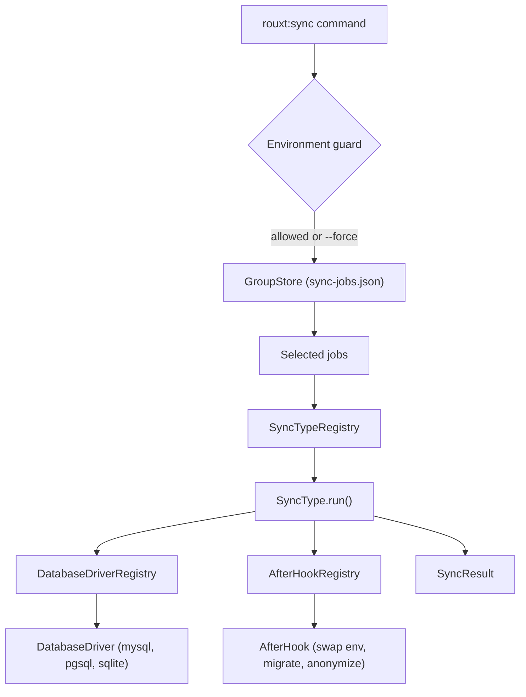

# Package: rouxtaccess/laravel-sync

A developer tool, distributed as a Laravel package, that pulls production data (databases, files, S3 buckets) down to a local environment. One interactive command, `php artisan rouxt:sync`, runs named groups of jobs. Every moving part (a sync type, a database engine, a post-sync hook, an anonymizer) is a small class registered in `config/sync.php`, so behaviour extends by adding a class, never by editing the package.

## Steering docs (read the one relevant to your task)

- **`docs/claude/`**: terse, code-focused steering for AI working on this package. Start at `docs/claude/README.md`. Covers the architecture, the plugin registries, how to add a sync type, driver, hook or anonymizer (`docs/claude/extending.md`), and how the tests are structured.
- **`docs/human/`**: plain-language docs for developers and operators. Covers what the package does, running a sync, configuration, extending (`docs/human/extending.md`), and security.
- **`resources/boost/guidelines/core.blade.php`**: the guidelines that ship to consuming apps through Laravel Boost (`php artisan boost:install` folds them into the app's `CLAUDE.md`). Update it whenever consumer-facing behaviour changes.

## Fast facts

- Commands: `rouxt:sync {group?} {--yes} {--force}` and `rouxt:sync-install`.
- Quality gates, all three must stay green: `composer test` (Pest), `vendor/bin/phpstan analyse`, `vendor/bin/pint`.
- Supports PHP 8.2 to 8.5 and Laravel 12 to 13. Do not use syntax newer than PHP 8.2.
- Follow the `php-guidelines-from-spatie` skill: prefer `protected` over `private`, return early instead of `else`, split compound `if`s, and use `/* */` block comments in config with defaults noted.
- Documentation (this file, `docs/`, `README.md`) must not use dashes as punctuation. Rephrase with commas, periods, or parentheses. Hyphens inside identifiers such as `db-over-ssh` and flags such as `--force` are fine.
- Groups persist to a gitignored plain-JSON file, `sync-jobs.json`, that holds plaintext secrets. Never commit it, never print its contents. `sync-jobs.example.json` is a valid-JSON reference of the shape.
- Safety is by construction: a sync only ever creates a new local database named `<prefix>_<date>` and copies downward. Never add code that writes to a production or upstream source.

## Architecture at a glance

## Working on this package

- Registries are bound in `SyncServiceProvider::packageRegistered()` from the config arrays. Adding a class to `config/sync.php` is the only registration step.
- The interactive layer is `laravel/prompts` (`intro`, `note`, `select`, `multiselect`, `password`, `confirm`, `table`, `spin`, `outro`). Long running work is wrapped in `spin()`.
- Processes shell out with `Illuminate\Support\Facades\Process`. Tests use `Process::fake()` to assert the exact command, so keep command construction inspectable.
- When you change a command signature, the guard, or the config shape, update `resources/boost/guidelines/core.blade.php`, `README.md`, and the relevant `docs/` page in the same change.
