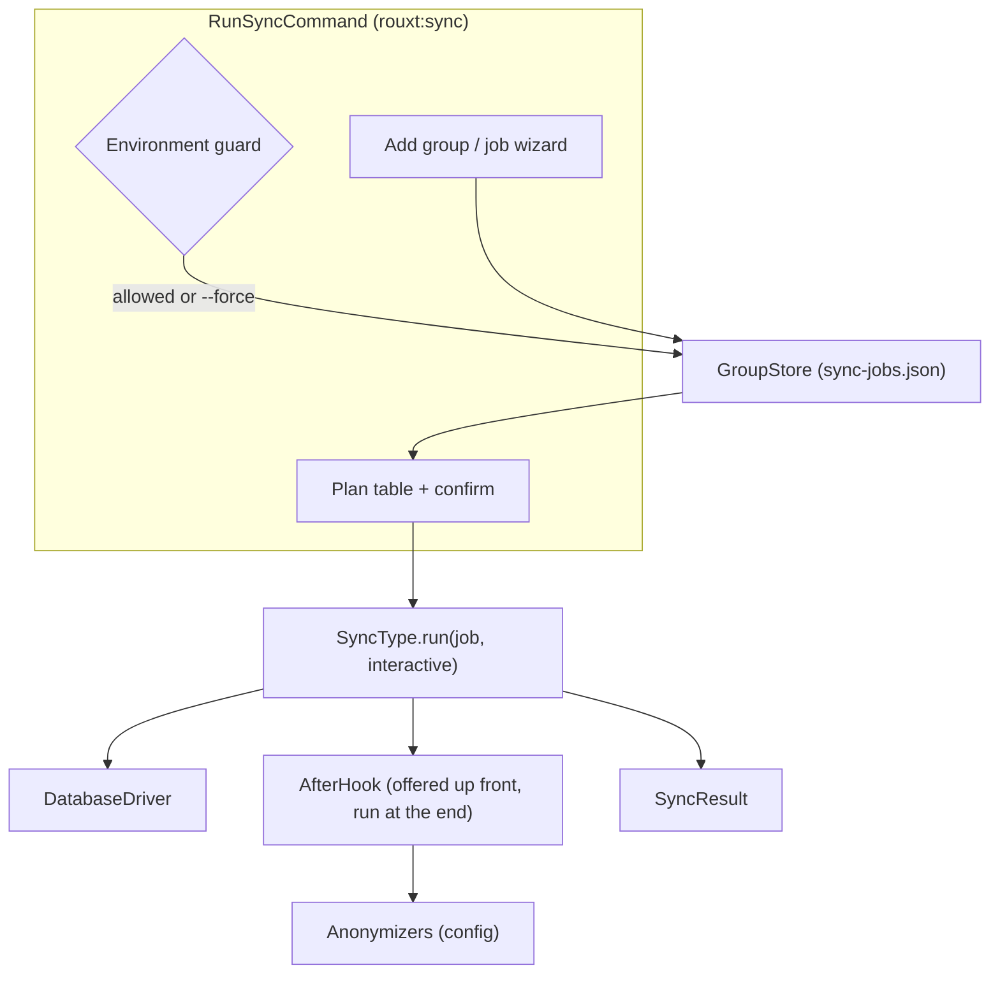
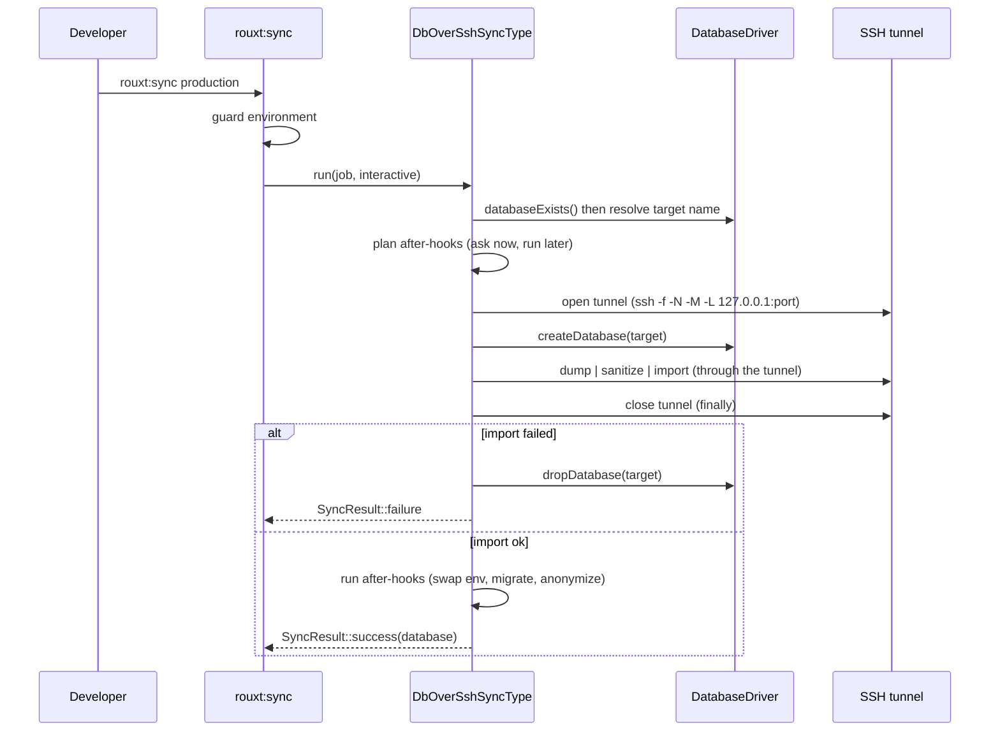
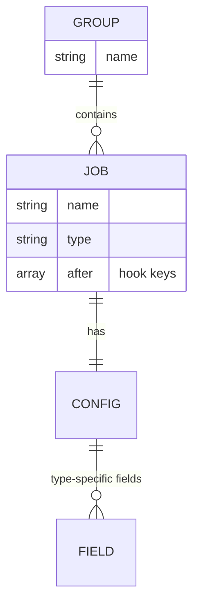

# Architecture

The package is a small plugin framework. Four kinds of class are registered in `config/sync.php` and resolved through registries bound in `SyncServiceProvider`.

| Concept | Contract | Registry | Registered in config |
| --- | --- | --- | --- |
| Sync type | `Contracts\SyncType` | `Registries\SyncTypeRegistry` | `types` |
| Database engine | `Contracts\DatabaseDriver` | `Registries\DatabaseDriverRegistry` | `database_drivers` |
| After-hook | `Contracts\AfterHook` | `Registries\AfterHookRegistry` | `after_hooks` |
| Anonymizer | invokable class or SQL string | read by `AnonymizeDatabaseHook` | `anonymizers` |

Supporting pieces:

- `Field`: a value object describing one prompt (label, secret, options, default and cast closures). A sync type returns an array of these from `fields()`.
- `SyncResult`: an immutable `ok` / `message` / `data` result. `data` carries the imported database name to the after-hooks.
- `GroupStore`: plain-JSON persistence for groups. Reads and writes strict JSON; a missing or malformed file yields an empty collection. It normalizes older flat jobs (fields at the top level) into the nested `config` shape on read, and `migrate()` rewrites the file in place; `rouxt:sync` calls it on run. `rouxt:sync-install` drops a valid-JSON `sync-jobs.example.json` reference beside it.

## Components



## The run flow for db-over-ssh

This is the richest path. The other types follow the same `run()` shape with a different pipeline.



Key invariants:

- The tunnel is always closed in a `finally` block.
- On failure the half-created database is dropped; an existing database is never dropped unless the user explicitly picks "replace".
- With `--yes` (non-interactive) a name clash aborts rather than overwriting, and no after-hooks run.

## Data shape of a group

A group is a named list of jobs in `sync-jobs.json`. A job has top-level `name` and `type`, a `config` object holding the fields its type declares, and an optional `after` allow-list of hook keys. `run(array $job, ...)` and `summary(array $job)` receive the whole job; field access is `$job['config'][...]`.



## Where things live

```
src/
  SyncServiceProvider.php      registries bound here from config
  Field.php  SyncResult.php  GroupStore.php
  Contracts/                   SyncType, DatabaseDriver, AfterHook
  Registries/                  one per contract
  Concerns/                    shared traits for types and hooks
  Types/                       db-over-ssh, db-from-s3, files-over-ssh, s3-sync
  Database/Drivers/            MysqlDriver, PostgresDriver, SqliteDriver
  Hooks/                       swap env, run migrations, anonymize
  Anonymizers/                 reusable example scrubbers
  Commands/                    RunSyncCommand, InstallCommand
```
