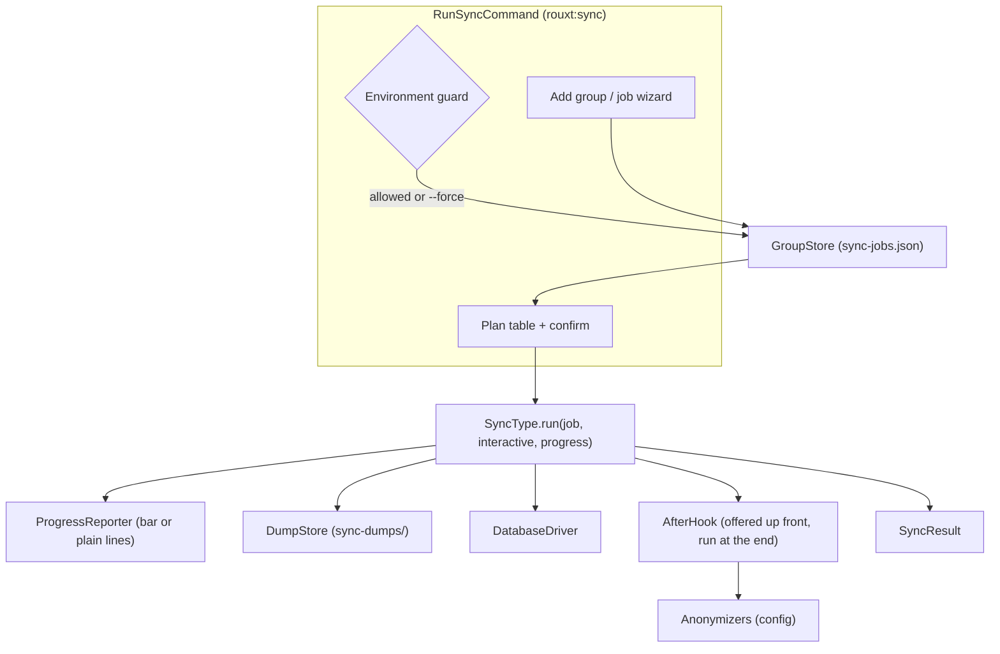
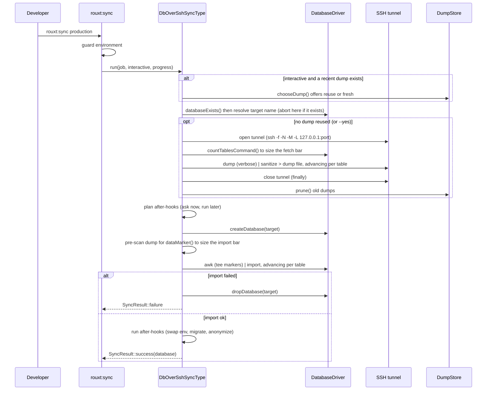
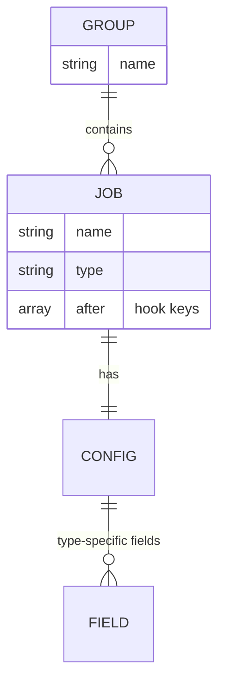

# Architecture

The package is a small plugin framework. Four kinds of class are registered in `config/sync.php` and resolved through registries bound in `SyncServiceProvider`.

| Concept | Contract | Registry | Registered in config |
| --- | --- | --- | --- |
| Sync type | `Contracts\SyncType` | `Registries\SyncTypeRegistry` | `types` |
| Database engine | `Contracts\DatabaseDriver` | `Registries\DatabaseDriverRegistry` | `database_drivers` |
| After-hook | `Contracts\AfterHook` | `Registries\AfterHookRegistry` | `after_hooks` |
| Anonymizer | invokable class or SQL string | read by `AnonymizeDatabaseHook` | `anonymizers` |

Supporting pieces:

- `Field`: a value object describing one prompt (label, secret, options, default and cast closures). A sync type returns an array of these from `fields()`.
- `SyncResult`: an immutable `ok` / `message` / `data` result. `data` carries the imported database name to the after-hooks.
- `GroupStore`: plain-JSON persistence for groups. Reads and writes strict JSON; a missing or malformed file yields an empty collection. It normalizes older flat jobs (fields at the top level) into the nested `config` shape on read, and `migrate()` rewrites the file in place; `rouxt:sync` calls it on run. `rouxt:sync-install` drops a valid-JSON `sync-jobs.example.json` reference beside it.
- `Contracts\ProgressReporter`: reports phase progress to the caller (`start`, `setTotal`, `advance`, `finish`). `run()` takes one as its required third arg. Three implementations in `src/Progress/`: `NullProgressReporter` (no-op, the test/silence default), `LineProgressReporter` (plain lines for non-interactive runs), `PromptsProgressReporter` (a live `laravel/prompts` bar for interactive TTY runs). `RunSyncCommand::progressReporter()` chooses between the last two.
- `Database\DumpStore`: manages the gitignored `sync-dumps/` directory (`dumps.path` / `dumps.keep`). `pathFor()`, `latest()`, `all()`, `prune()`. Dumps are timestamped, so a reverse lexical sort is reverse chronological.
- `Concerns\FetchesAndLoadsDatabase`: the fetch-then-load flow shared by the DB types (`chooseDump()`, `loadDump()`, the marker-teeing import pipeline). `Concerns\StreamsProcessProgress`: runs an untimed process and splits its live output into lines (both `\r` and `\n`) so a type can drive a bar from what the command prints.

## Components



## The run flow for db-over-ssh

This is the richest path. It splits into a **fetch** (pull a dump to a file) and a **load** (import that file), shared through `Concerns\FetchesAndLoadsDatabase`. The other DB type (`db-from-s3`) reuses the same load with a different fetch; the file types (`files-over-ssh`, `s3-sync`) follow the same `run()` shape with a single pipeline.



Key invariants:

- The local target name is resolved before any fetch. A run that will be turned away (the target already exists and a non-interactive run, or the user declines to replace) never opens the tunnel or hits production.
- The tunnel is always closed in a `finally` block, and is only opened when a fresh dump is being fetched.
- The fetch writes a plaintext dump to `sync-dumps/`. Because it is a file, a fetch and a load can happen independently: an interactive run can reuse a recent dump (skipping production), while `--yes` always fetches fresh.
- Both phases drive the passed `ProgressReporter`. The fetch bar is sized by the remote table count and advanced against `dumpProgressPattern()`; the load bar is sized by pre-scanning the dump for `dataMarker()` and advanced by teeing each marker line to stderr through `awk`.
- On failure the half-created database is dropped; an existing database is never dropped unless the user explicitly picks "replace". Both phases report only the real error, filtering the verbose dump chatter (`isDumpNoise()`) and the teed import markers out of the message.
- With `--yes` (non-interactive) a name clash aborts rather than overwriting, and no after-hooks run.

## Data shape of a group

A group is a named list of jobs in `sync-jobs.json`. A job has top-level `name` and `type`, a `config` object holding the fields its type declares, and an optional `after` allow-list of hook keys. `run(array $job, ...)` and `summary(array $job)` receive the whole job; field access is `$job['config'][...]`.



## Where things live

```
src/
  SyncServiceProvider.php      registries bound here from config
  Field.php  SyncResult.php  GroupStore.php
  Contracts/                   SyncType, DatabaseDriver, AfterHook, ProgressReporter
  Registries/                  one per contract
  Progress/                    Null / Line / Prompts ProgressReporter
  Concerns/                    shared traits (fetch/load, stream progress, driver, hooks)
  Types/                       db-over-ssh, db-from-s3, files-over-ssh, s3-sync
  Database/                    DumpStore + Drivers/ (MysqlDriver, PostgresDriver, SqliteDriver)
  Hooks/                       swap env, run migrations, anonymize
  Anonymizers/                 reusable example scrubbers
  Commands/                    RunSyncCommand, InstallCommand
```
