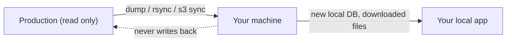

# Developer and operator docs

Plain-language docs for people using `rouxtaccess/laravel-sync`.

- [Running a sync](running-a-sync.md): the day-to-day flow, from install to a refreshed local database.
- [Configuration](configuration.md): the config file, the store file, sync types, drivers, hooks, and the environment guard.
- [Extending](extending.md): teaching the tool new tricks, in plain language.
- [Security](security.md): where secrets live and how to keep them safe.

## What this package does

It refreshes your local environment with real data from production, without a pile of one off scripts. You configure named groups of jobs once, then run them whenever you want fresh data:

```bash
php artisan rouxt:sync production
```

A group is a set of jobs. A job is one unit of work: a database, a folder of files, or an S3 bucket. The tool dumps databases live over an SSH tunnel, copies files with rsync, and mirrors buckets with the AWS CLI.

## The safety model

The tool is built so it cannot damage production:

- It only ever creates a new local database, named `<prefix>_<date>`. It never writes back to the source.
- It refuses to run outside your allowed environments (by default `local`, `development`, `testing`) unless you pass `--force`.
- File and bucket deletion is off by default. You opt in per job.


