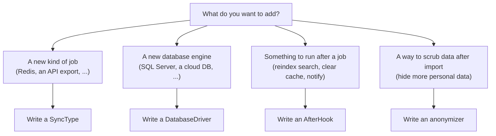

# Extending

Laravel Sync is designed to be extended, and doing so is meant to feel easy. This is the most important thing to understand about the package: the command, the store, and the prompts are a thin shell, and **every piece of real behaviour is a small class you register in `config/sync.php`**. There are no hardcoded sync steps, no fixed list of engines, and no baked in post-processing. If you can write a class, you can teach the tool a new trick, and you never fork or edit the package to do it.

This page starts with the plain-language tour, then gives the full walkthrough with complete code for each case. The one rule that never bends: a sync reads from upstream and writes locally. Never add an extension that writes back to a production source.

## What you can add



| If you want to | You write | Register under |
| --- | --- | --- |
| Pull a new kind of thing (a job type) | A sync type class | `types` |
| Support another database engine | A database driver class | `database_drivers` |
| Do something once a job succeeds | An after-hook class | `after_hooks` |
| Hide more sensitive data after an import | An anonymizer (a class or a line of SQL) | `anonymizers` |

## How it fits together

1. You write a class that implements the matching contract (or, for an anonymizer, an invokable class or a line of SQL).
2. You add the class name to the right list in `config/sync.php`.
3. The next time someone runs `php artisan rouxt:sync`, your addition is offered in the wizard and runs like any built in one.

There is no extra wiring. The lists in the config file are the whole menu. You can also remove a built in you do not want by leaving it out of the list, or replace one by registering your own subclass in its place. The registry resolves each class from the container, so your class can type-hint dependencies in its constructor and they are injected.

```php
'types' => [
    // package defaults
    App\Sync\Types\RedisSyncType::class,
],
```

## Prompts: the `Field` object

A sync type describes what to ask the user by returning `Field` objects from `fields()`. The command turns each `Field` into the right prompt, so a custom type gets its own questions with no UI code.

| Property | Meaning |
| --- | --- |
| `key` | The array key the answer is stored under in the job |
| `label` | The prompt label |
| `required` | Whether an answer is required (default true) |
| `secret` | Render as a password prompt (hidden input) |
| `boolean` | Render as a yes/no confirm |
| `options` | An array of `value => label` to render a select |
| `default` | A string, a bool, or a closure `fn (array $answers) => ...` that can depend on earlier answers |
| `placeholder` | Placeholder text for a text prompt |
| `hint` | A hint line under the prompt |
| `cast` | A closure `fn ($value) => ...` to transform the answer (for example to an int) |

Example, a port that defaults from the chosen driver and is cast to an int:

```php
new Field(
    'db_port',
    'Remote DB port',
    default: fn (array $answers): string => (string) $this->driver($answers)->defaultPort(),
    cast: fn ($value): int => (int) $value,
);
```

## Add a sync type

A sync type answers three questions: what to ask (`fields`), what to show in the plan (`summary`), and what to do (`run`). `run` returns a `SyncResult`.

```php
use Rouxtaccess\Sync\Contracts\SyncType;
use Rouxtaccess\Sync\Field;
use Rouxtaccess\Sync\SyncResult;
use Illuminate\Support\Facades\Process;

use function Laravel\Prompts\spin;

class RedisSyncType implements SyncType
{
    public static function key(): string
    {
        return 'redis-copy';
    }

    public static function label(): string
    {
        return 'Redis, copy keys from a remote instance';
    }

    public function fields(): array
    {
        return [
            new Field('ssh', 'SSH target', placeholder: 'forge@1.2.3.4'),
            new Field('flush_local', 'Flush the local Redis first?', required: false, boolean: true, default: false),
        ];
    }

    public function summary(array $job): array
    {
        $config = $job['config'] ?? [];

        return [
            ['Type', self::label()],
            ['Source', $config['ssh']],
            ['Flush local first', data_get($config, 'flush_local') ? 'yes' : 'no'],
        ];
    }

    public function run(array $job, bool $interactive): SyncResult
    {
        $config = $job['config'] ?? [];

        $result = spin(
            message: 'Copying Redis keys...',
            callback: fn () => Process::timeout(0)->run([/* your command, reading $config */]),
        );

        return $result->failed()
            ? SyncResult::failure(trim($result->errorOutput()) ?: 'Redis copy failed.')
            : SyncResult::success('Copied Redis keys.');
    }
}
```

`run` and `summary` receive the whole job. The answers to your `fields()` live in `$job['config']`, so most types start with `$config = $job['config'] ?? [];`.

For a database style type, reuse the traits that already handle the hard parts:

- `Concerns\InteractsWithDatabaseDriver` gives you `driver()`, `driverField()`, `targetDatabase()`, and `resolveTarget()` (the abort / replace / rename flow for an existing local database).
- `Concerns\InteractsWithAfterHooks` gives you `planAfterHooks()` and `runAfterHooks()`.

Study `src/Types/DbOverSshSyncType.php` as the reference implementation.

### The interactive flag and SyncResult

`run(array $config, bool $interactive)` receives `$interactive = false` when the user passed `--yes` or there is no terminal. Respect it: do not prompt when it is false, and choose safe defaults (for example, abort on a name clash rather than overwrite).

`SyncResult::success($message, $data)` and `SyncResult::failure($message)` are the only two outcomes. For database types, put the imported database name in `$data` (`['database' => $target]`) so after-hooks can use it.

## Add a database engine

Implement `Contracts\DatabaseDriver`. It creates and drops the local database, checks existence, and returns the shell fragments for the dump, sanitize, and import pipeline. Local client settings come from `config('database.connections.*')`, so your engine talks to the same database your app does.

Rules to follow, copied from the built in drivers:

- Return `0` from `defaultPort()` for a file based engine with no network port. The `db-over-ssh` type checks this and refuses to tunnel, pointing the user at `files-over-ssh` instead.
- Pass passwords through the environment (`MYSQL_PWD`, `PGPASSWORD`), never on the command line.
- `escapeshellarg` every value you interpolate into a command.
- Return a stdin filter from `sanitizePipe()` if the dump needs cleaning (MySQL strips DEFINER clauses this way), or `null` if not.

`src/Database/Drivers/MysqlDriver.php` is the fullest example; `SqliteDriver.php` shows the file based, portless case.

## Add an after-hook

An after-hook runs once a job succeeds. It is offered up front (in the same step where the user handles a name clash) and executed at the end.

```php
use Rouxtaccess\Sync\Contracts\AfterHook;

use function Laravel\Prompts\confirm;

class ReindexSearchHook implements AfterHook
{
    public static function key(): string
    {
        return 'reindex-search';
    }

    public static function label(): string
    {
        return 'Rebuild the search index from the imported data';
    }

    public function appliesToJob(array $job): bool
    {
        return str_starts_with($job['type'] ?? '', 'db-');
    }

    public function prompt(array $job, array $context, bool $interactive): bool
    {
        return $interactive && confirm('Rebuild the search index afterwards?', default: false);
    }

    public function handle(array $job, array $context): string
    {
        // do the work, using $context['database'] if you need the imported DB
        return 'Search index rebuilt.';
    }
}
```

Two things to know:

- Hooks run in the order they are listed under `after_hooks`. The defaults list `swap-env-database` before `run-migrations` on purpose, so migrations run against the database the env now points at.
- For a hook that queries the imported database, use `Concerns\ConnectsToImportedDatabase`. Its `onImportedDatabase($job, $context, fn ($connection) => ...)` points the job's connection at the new database and runs your callback against it. `RunMigrationsHook` and `AnonymizeDatabaseHook` both use it.

## Add an anonymizer

An anonymizer scrubs data out of a freshly imported database. List it under `anonymizers`. It is either a raw SQL statement or the class name of an invokable action that receives the connection name.

```php
class ScrubApiTokens
{
    public function __invoke(string $connection): void
    {
        DB::connection($connection)->table('api_tokens')->update(['token' => null]);
    }
}
```

The package ships `Anonymizers\AnonymizeUserEmails` and `Anonymizers\AnonymizeUserPhoneNumbers`. They use the `Anonymizers\Concerns\AnonymizesTable` trait, which scrubs a table one row at a time (so replacements stay unique) and no-ops when a table or column is absent, portably across MySQL, PostgreSQL and SQLite. Copy one as a template for another table.

## Replacing or removing defaults

The registries are just config arrays, so you are not limited to adding. Extend a default and swap it in:

```php
'database_drivers' => [
    App\Sync\Drivers\TunedMysqlDriver::class, // extends MysqlDriver, different dump flags
    Rouxtaccess\Sync\Database\Drivers\PostgresDriver::class,
],
```

Or remove a type your team should never use by leaving it out of the array. Whatever is in the config is the whole menu.

## Test your extension

Extensions are easy to test the same way the package tests itself.

- Assert command construction with `Process::fake()` and `Process::assertRan(...)` instead of running the real binary.
- Run anonymizers and database-touching hooks against the in-memory SQLite connection, building a table with the schema builder and asserting on the rows.
- For a sync type, call `run($config, false)` directly and assert on the returned `SyncResult`.

The `tests/` directory has working examples of each. A real end to end sync needs production access (SSH keys, AWS credentials), so keep that final live check for a developer who has it.
