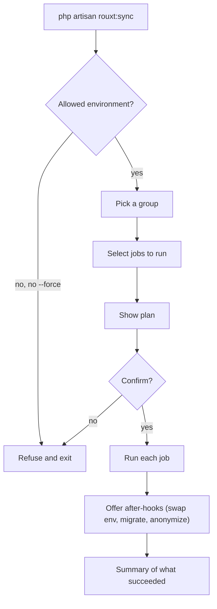

# Running a sync

## First time setup

Install the package and publish its files:

```bash
composer require rouxtaccess/laravel-sync --dev
php artisan rouxt:sync-install
```

`rouxt:sync-install` publishes `config/sync.php`, writes a `sync-jobs.example.json` reference file, and adds the real store (`sync-jobs.json`) to your `.gitignore`.

## Configure a group

Run the command with no arguments and follow the prompts. You will name the group, pick a sync type, answer a few questions, and choose which after-hooks to offer.

```bash
php artisan rouxt:sync
```

The group is saved to `sync-jobs.json` as plain JSON. You can also edit that file by hand, or copy a group out of `sync-jobs.example.json`.

## Run a group

```bash
php artisan rouxt:sync production
```

You will see a plan of every job, then a confirmation before anything runs. Add `--yes` to skip the prompts (useful in a script), and `--force` to run in an environment that is not on the allow list.



## What happens to a database job

The dump is imported into a brand new local database named after the job's prefix and today's date, for example `myapp_2026_07_16`. If that name already exists, an interactive run lets you abort, replace it, or import under a different name. Your current working database is never touched unless you choose to replace it or accept the "point .env at the new database" hook.

## Requirements on your machine

Install the client tools for the jobs you run: `ssh`, `rsync`, `mysqldump` and `mysql`, `pg_dump` and `psql`, `sqlite3`, and the `aws` CLI. The tool talks to your production server with your own SSH key, and to S3 with your own AWS credentials.
