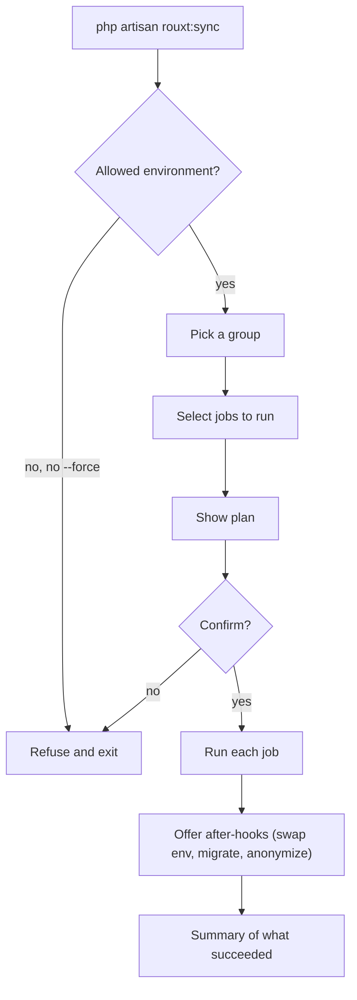

# Running a sync

## First time setup

Install the package and publish its files:

```bash
composer require rouxtaccess/laravel-sync --dev
php artisan rouxt:sync-install
```

`rouxt:sync-install` publishes `config/sync.php`, writes a `sync-jobs.example.json` reference file, and adds the real store (`sync-jobs.json`) and the `sync-dumps/` directory to your `.gitignore`.

## Configure a group

Run the command with no arguments and follow the prompts. You will name the group, pick a sync type, answer a few questions, and choose which after-hooks to offer.

```bash
php artisan rouxt:sync
```

The group is saved to `sync-jobs.json` as plain JSON. You can also edit that file by hand, or copy a group out of `sync-jobs.example.json`.

## Run a group

```bash
php artisan rouxt:sync production
```

You will see a plan of every job, then a confirmation before anything runs. Add `--yes` to skip the prompts (useful in a script), and `--force` to run in an environment that is not on the allow list.

## Progress while a job runs

Every job shows its progress as it works. In an interactive terminal you get a live progress bar: a database job advances one step per table (first while the dump is fetched, then again while it is imported), an `s3-sync` job advances per file copied, and a `files-over-ssh` job shows the rsync percent. When you pass `--yes`, or when the output is piped somewhere (a log, a CI job), the bar is replaced by plain progress lines so it stays readable.



## What happens to a database job

A database job runs in two phases. First it **fetches** a dump of the remote data to a file on disk under `sync-dumps/` (a `mysqldump` or `pg_dump` over the SSH tunnel for `db-over-ssh`, or a download and decompress from S3 for `db-from-s3`). Then it **loads** that dump file into a brand new local database named after the job's prefix and today's date, for example `myapp_2026_07_16`. If that name already exists, an interactive run lets you abort, replace it, or import under a different name. Your current working database is never touched unless you choose to replace it or accept the "point .env at the new database" hook.

## Reusing a dump (pull once, import many)

Because the fetch writes the dump to a file, you do not have to hit production every time you rebuild your local database. When an interactive `db-over-ssh` or `db-from-s3` run finds a recent dump for that job, it asks whether to reuse it (skipping production) or pull a fresh one. Reusing is much faster and puts no load on the production server, which makes it the natural choice while you are iterating on a migration or debugging locally. A non-interactive run (`--yes`) always pulls a fresh dump.

The package keeps the few most recent dumps per job (three by default, configurable with `dumps.keep`) and prunes older ones after each fetch. These files hold plaintext production data, so `sync-dumps/` is gitignored. Keep it out of version control.

## Requirements on your machine

Install the client tools for the jobs you run: `ssh`, `rsync`, `mysqldump` and `mysql`, `pg_dump` and `psql`, `sqlite3`, and the `aws` CLI. The tool talks to your production server with your own SSH key, and to S3 with your own AWS credentials.
